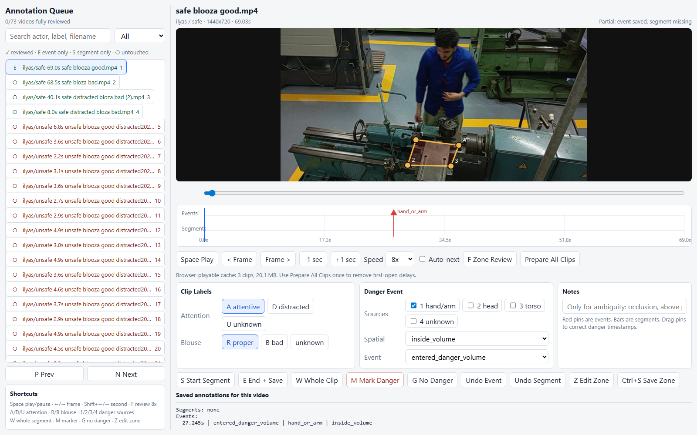
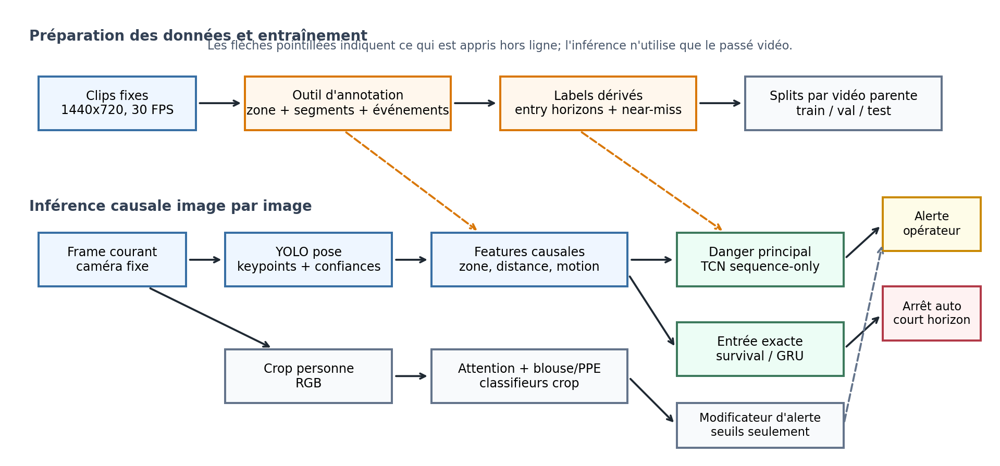
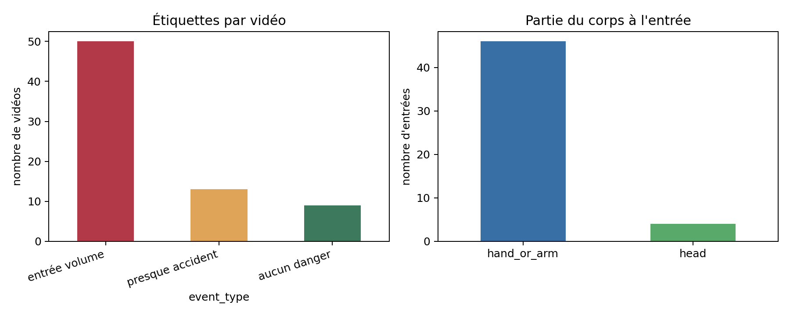
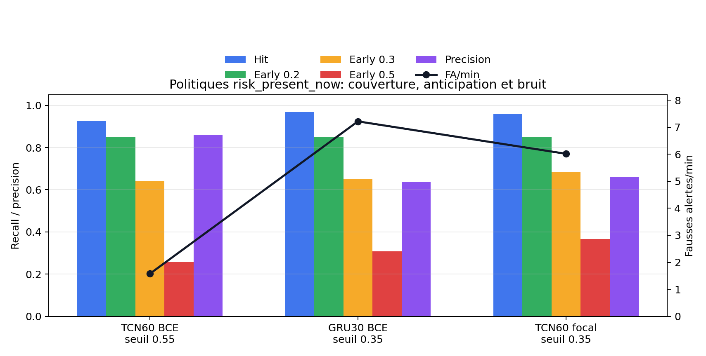
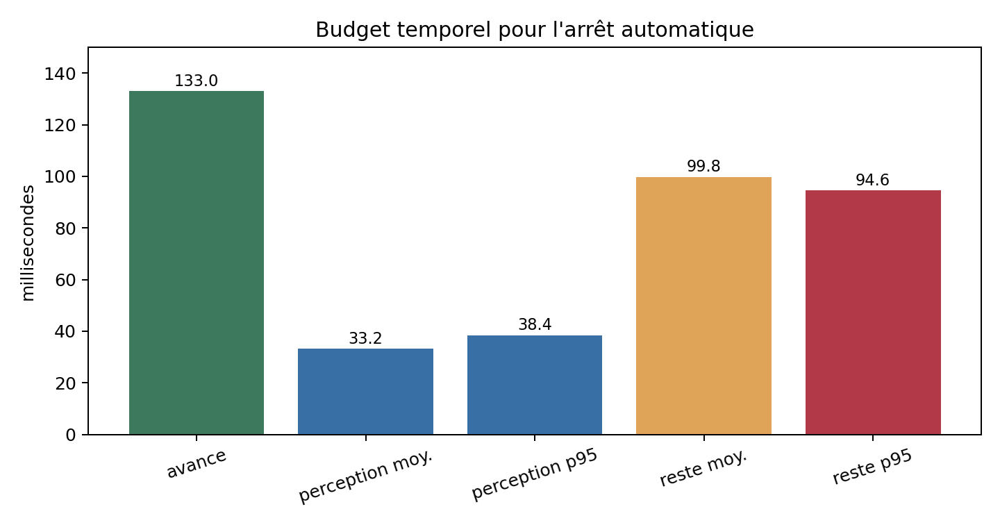

# Pose Recognition Machine Safety

This documentation covers the fixed-camera pose recognition proof of concept for machine-safety risk prediction.

The project combines video capture, annotation, pose/keypoint extraction, temporal danger prediction, attention classification, blouse/PPE classification, and a fused operational risk score.

## Visual Overview



The browser annotation tool is the main workflow for reviewing clips, drawing the projected danger zone, marking danger events, and saving segment labels.



The research pipeline combines trajectory danger risk, attention risk, and blouse/PPE risk into a final operational risk score.

## Documentation Map

- [Architecture and Annotation](architecture_and_annotation.md): project framing, defensible claims, dataset grounding, annotation strategy, and reliability boundaries.
- [Annotation Tool Usage](annotation_tool_usage.md): how to run the browser annotation tool, define the danger zone, label videos, and validate annotations.
- [ML Autonomous Training Runbook](ml_autonomous_training_runbook.md): durable research plan, model targets, augmentation policy, evaluation criteria, experiment status, and final acceptance criteria.
- [Project Artifacts](artifacts.md): downloadable reports, presentation decks, and pointers to the experiment notebooks.

## Quick Start & Sample Video

To allow immediate, out-of-the-box execution, a lightweight sample video from the dataset is whitelisted and pushed directly in this Git repository:
- **Path**: `captures/ilyas/unsafe/unsafe blooza good  20260512_190928.mp4` (3.2 MB)

### Run instructions:

1. **Install dependencies**:
   ```powershell
   python -m pip install -r requirements.txt
   ```

2. **Run the browser annotation tool**:
   ```powershell
   python web_annotator_server.py
   ```

3. **Annotate in your browser**:
   Navigate to [http://127.0.0.1:8765](http://127.0.0.1:8765). The sample video will automatically load in the active queue. You can practice defining the danger zone polygon, selecting segment attention/PPE labels, and marking danger timeline event timestamps.

4. **Validate annotations**:
   Ensure all saved outputs are fully syntactically correct and conform to schema:
   ```powershell
   python validate_annotations.py
   ```

## Scope

This is an academic proof-of-concept, not a production-certified industrial safety system. The current danger region is modeled as a fixed 2D image-space polygon because the camera and machine are fixed and the dataset does not include above-zone motion.

## Result Figures






